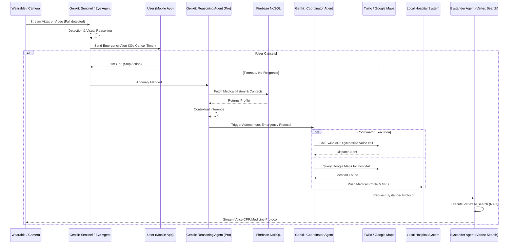

# Agentic Workflow & Architecture

This document breaks down the "Action-Oriented" Agentic AI flow at the heart of our platform. We designed this architecture using the **Google AI Ecosystem Stack** to perfectly align with the Project 2030 MyAI Future Hackathon "Build With AI" mandate.

## Core Objective
Transitioning from simple generative text to an autonomous system capable of reasoning through sudden medical crises, planning multi-step interventions, and executing external API triggers (calling ambulances, routing to hospitals, issuing CPR instructions).

---

## 🤖 The Autonomous Agents

Our solution leverages **Vertex AI Agent Builder** to create specialized AI personas that collaborate via a **Firebase Genkit** orchestration backbone.

1.  **Vital Diagnostics Agent (The Sentinel):** 
    *   *LLM:* Gemini 2.0 Flash
    *   *Role:* Constantly ingests structured JSON streams from wearable devices (Heart Rate, SpO2, Blood Pressure). It uses Gemini Flash for ultra-low latency inference to flag abnormalities.
2.  **Vision Monitoring Agent (The Eye):**
    *   *LLM:* Gemini 2.0 Multimodal
    *   *Role:* Analyzes home camera feeds for physical anomalies (e.g., fall detection, lack of movement). It provides visual reasoning to confirm if a fall occurred and the likely severity.
3.  **Clinical Reasoning Agent (The Physician):**
    *   *LLM:* Gemini 2.0 Pro
    *   *Role:* Activated upon a flagged vital or vision anomaly. It cross-references user data from Firebase and visual context to infer the probability of a critical event (e.g., "Fall detected + low heart rate = high probability of stroke/fainting").
4.  **Emergency Coordinator Agent (The Dispatcher):**
    *   *LLM:* Vertex AI Agent Builder & Firebase Genkit
    *   *Role:* The central executor. Once a high-risk event is confirmed, it executes tools asynchronously.
    *   *Tools:* Twilio API (Voice dispatch), Google Maps ETA Routing, Hospital Data Push Webhooks.
4.  **Bystander Protocol Agent (The Medic):**
    *   *LLM:* Vertex AI Search (RAG) + Gemini 2.0 Pro
    *   *Role:* Retrieves grounded, verified First Aid / CPR protocols specific to the region and streams audio instructions to the patient's device speaker to guide nearby relatives/bystanders.

---

## 🌊 The Agentic Flow (Execution Sequence)

Below is the execution flow detailing exactly how our ecosystem operates autonomously.

## 🛠 Technical Alignment with Hackathon Requirements

Every step of this workflow validates a required Google AI component:

*   **Intelligence:** We specifically delineate **Flash** for speed (streams) and **Pro** for complex conditional reasoning (medical profiling).
*   **Orchestration:** **Firebase Genkit** serves as the connective tissue that handles the "If-This-Then-That" tool utilization.
*   **Context:** By integrating **Vertex AI Search**, we ensure the AI does not hallucinate medical procedures, but instead grounds its instructions in accurate, indexed national guidelines for CPR and first aid.
*   **Actionable Ecosystem:** The system moves beyond the interface, directly communicating with external reality (Twilio, Maps, Hospitals) to solve the real-world challenge of emergency response delays.
